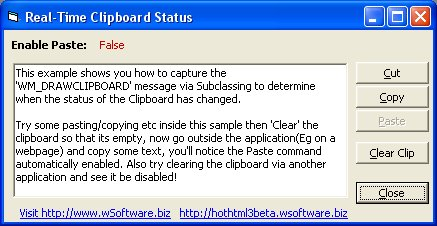



## Professional Clipboard

### Description

This example shows you how to capture the 'WM_DRAWCLIPBOARD' message via Subclassing to determine when the status of the Clipboard has changed.

It adds a more 'Professional' look to your application and shows you some of the reasons why Subclassing can help make your applications more professional.

Credits goto Steve McMahon(you legend) for his excellent subclassing control, Gonchuki for reminding me to add this baby to HotHTML 3 (thanks) and anyone else i may have forgotten(?)
 
### More Info
 
You have downloaded the SSubTmr6.dll component - Subclassing Timer Assitant from vbAccelerator.com.

People think your a pro?

             |
---                |---
**Submitted On**   |1999-02-19 08:54:26
**By**             |[Thushan Fernando](https://github.com/Planet-Source-Code/PSCIndex/blob/master/ByAuthor/thushan-fernando.md)
**Level**          |Intermediate
**User Rating**    |4.5 (18 globes from 4 users)
**Compatibility**  |VB 4\.0 \(32\-bit\), VB 5\.0, VB 6\.0
**Category**       |[Miscellaneous](https://github.com/Planet-Source-Code/PSCIndex/blob/master/ByCategory/miscellaneous__1-1.md)
**World**          |[Visual Basic](https://github.com/Planet-Source-Code/PSCIndex/blob/master/ByWorld/visual-basic.md)
**Archive File**   |[Profession1560323162003\.zip](https://github.com/Planet-Source-Code/thushan-fernando-professional-clipboard__1-44048/archive/master.zip)

### API Declarations

See in Code

